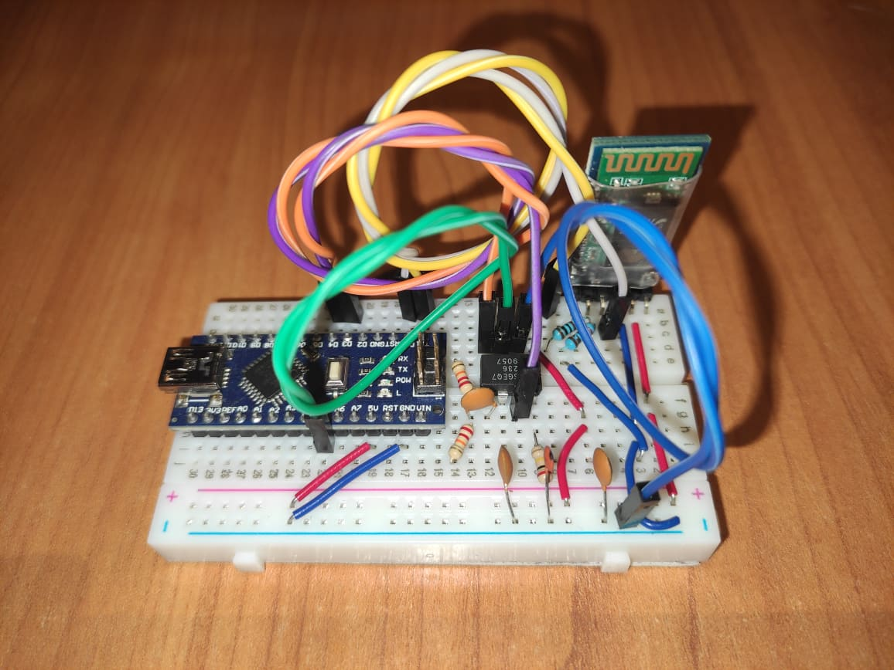

# Audio-Spectrum-Visualizer-V2
Hello everyone!
Here we have the project which I created for myself.
It's the better version of the Audio-Spectrum-Visualizer.
Using my mobile application and Bluetooth HC-05, I can take control of the colors of the LEDs.
App was coded in the MIT App Inventor. It's only Android version. The QR code for download and instalation process You can see below.
The most important component of my project is MSGEQ7 which is the seven band graphic equalizer IC is a CMOS chip
that divides the audio spectrum into seven bands.
This time I used Arduino Nano because I wanted to keep the electronic circuit in a minimalist form.
Here we have gifs:

--------------------------------------------------------------------------------------------------------------------
*Electronic model*

--------------------------------------------------------------------------------------------------------------------
*QR CODE*

--------------------------------------------------------------------------------------------------------------------
*To install application You should download MIT AI2 Companion app*

--------------------------------------------------------------------------------------------------------------------
*After installation You should see the application*

